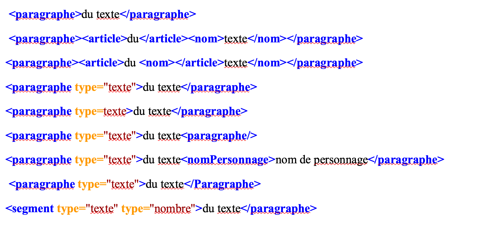

# Atelier XML TEI
*Ariane Pinche 
10 mai 2022*


## **EnExDi**
Les humanités numériques dans les projets de recherche
9-13 mai 2022 Poitiers (France)

---
# Principes de base

XML est un format de données pur, très simple et documenté, conçu pour la description des documents textuels. XML ne possède pas de jeu de balises prédéfini.

```xml
<note>
<to>Tove</to>
<from>Jani</from>
<heading>Reminder</heading>
<body>Don't forget me this weekend!</body>
</note>
```
---

## Structure générale du XML

Les données sont incluses dans le document XML sous forme de chaînes de caractères délimitées par un balisage les décrivant. L’unité de base qui comprend données et balisage est appelée élément.

*Exemple* : `<nomElement>chaineCaracteres</nomElement>`

---

Les éléments XML suivent un principe d’arborescence par imbrication.

*Exemple* :

```XML
<elementParent>
  <elementEnfant>chaineCaracteres</elementEnfant>
</elementParent>
```

Ainsi les éléments *enfants* héritent des propriétés des éléments *parents*

---

# Les éléments XML

## Éléments et attributs

#### Les éléments
`<element>texte</element>` ou `<elementVide/>`

Les éléments doivent tous strictement respecter le principe d'imbrication. Les éléments s’imbriquent les uns dans les autres et ne peuvent pas se chevaucher : 


---

#### Les attributs

```XML
<MiseEnValeur rendu="rouge italique" position="bas">
  texte
</MiseEnValeur>
```

---

**Quelques règles importantes :**

- à chaque balise de début doit correspondre une fin de balise;
- les éléments peuvent être imbriqués, mais ils ne doivent pas se recouvrir;
- il ne doit y avoir qu’un seul élément racine;
- un élément ne doit pas avoir deux attributs avec le même nom.


Un encodage qui respecte ces grands principes du XML est dit __bien formé__.

---

## Exercice bien formé ou pas ?



---


## TEI, mode d'emploi

- TEI est un set de balises prédéfini et documenté dans les [*TEIguidelines*](https://tei-c.org/release/doc/tei-p5-doc/en/html/index.html).
- Elle permet de procéder à une description «sémantique» d’un texte.
- Les balises TEI forment un framework, utile à la conception de son propre encodage. Il faut concevoir un modèle de données (soit un schéma de type ODD) le plus simple possible et adapté à son projet et sa question de recherche.

*Pour aller plus loin* : [Why do we encode : E. Pierazzo](https://www.youtube.com/watch?v=R0ncI_rr1z4&list=PL77mHK9JuenN9NXeXQbVcUORz7HZk-9Pv&index=3)

---

## Quels sont les avantages de TEI ?

- TEI s’intéresse au sens du texte plutôt qu’à son apparence ;
- TEI est indépendant de tout environnement logiciel particulier;
- TEI a été conçu par la communauté scientifique qui est aussi en charge de son développement continu.

---

## Prise en main : Encoder une carte postale

- Observer les fichiers : CartePostale_r et CartePostale_v ;
- Compléter le canevas TEI : Carte_postale_patron ;

---

## Structuration d'un fichier TEI

Tout document TEI a au moins deux parties : 

* Un en-tête, représenté au moyen d’un élément **`<teiHeader>`** contenant des métadonnées décrivant le document ;
* le texte lui-même, représenté par un élément **`<text>`**.

`<TEI xmlns=’http://www.tei-c.org/​ns/​1.0’>`
     `<teiHeader>`
         `<!-- métadonnées décrivant un texte -->`
    `</teiHeader>`
     `<text>`
         `<!-- une représentation du texte lui-même -->`
     `</text>`
`</TEI>`

----

Le **teiHeader** minimal comporte les trois sections suivantes :

   * `<titleStmt>` : informations identifiant le document lui-même ;
   * `<publicationStmt>` : informations sur la façon dont il est distribué ou publié ;
   * `<sourceDesc>` : indications sur ses origines. 

L’**élément `<text>`** contient les trois parties suivantes :

   * `<front>` : pour les préfaces, et tous les éléments liminaires du texte ; 
   * `<body>` : pour le corps du texte proprement dit ;
   * `<back>` : pour tous les appendices, épilogues, postfaces, etc.

----

## Le teiHeader

L’en-tête TEI possède quatre composants principaux :

* `<fileDesc>` : description bibliographique du document, **attention : il est obligatoire** ;
* `<encodingDesc>` : description de l’encodage ;
* `<profileDesc>` : description détaillée des aspects non bibliographiques;
* `<revisionDesc>` (revision description, description des révisions) résume l’historique des révisions pour un fichier.


---

## Le fileDesc

Il se compose de trois parties obligatoires :

* `<titleStmt>` : Déclaration du titre ;
* `<publicationStmt>` :  Déclaration de la publication ;
* `<sourceDesc>` : Description de la source.
---

Exemple :

`<teiHeader>`
     `<fileDesc>`
         `<titleStmt>`
             `<title>Titre de l’œuvre</title>`
         `</titleStmt>`
         `<publicationStmt>`
             `<p>Informations sur la publication de l’œuvre.</p>`
         `</publicationStmt>`
         `<sourceDesc>`
             `<p>Informations sur la source dont est tirée l’œuvre.</p>`
         `</sourceDesc>`
     `</fileDesc>`
`</teiHeader>`

---


## Encoder en TEI un texte simple

Exercice n°1

Encoder en XML TEI, le poème Mon Rêve familier de Paul Verlaine à l'aide des balises suivantes : ```<lg>, <l> et <head>``` et en ajoutant des attributs si besoin. Voir la documentation suivante :  
http://www.tei-c.org/release/doc/tei-p5-doc/fr/html/VE.html

---


## Encoder une pièce de théâtre

Convertir en XML TEI, l’extrait du Misanthrope de Molière en vous aidant de la documentation et des balises suivantes : ```<castList>, <castItem>, <speaker>, <stage>, <head>, <div>, <sp> et <l>.```
Documentation dans les guidelines :https://tei-c.org/release/doc/tei-p5-doc/en/html/DR.html

---

# Structurer un texte et créer des index : exercice guidé

Nous allons encoder les deux premiers paragraphes de *Notre Dame de Paris*, II, chapitre 1, «De Charybde en Scylla » (début de chapitre à « La cohue admirait »). 

 - Nous hiérarchiserons le texte en chapitre et paragraphes
 - Nous repèrerons dans l’extrait les noms de lieux et réaliserons un index. 
  
 
La structure du livre est aussi disponible sur wikisource : 
https://fr.wikisource.org/wiki/Notre-Dame_de_Paris/Livre_deuxi%C3%A8me#II._La_place_de_Gr.C3.A8ve

---

## Encoder la structure du document. 

a)  Ouvrir un nouveau document XML sur Oxygen : Nouveau document à Dossier TEI P5 à All. Le document qui apparaît possède déjà une structure valide qu’il s’agira de remplir et respecter. 
b)  Remplir le Teiheader avec les informations sur le texte disponible sur wikisource. 
c)  Pour la partie texte, on ne remplira que les informations qui nous permettent d’encoder cet extrait en signalant le livre et le chapitre en cours, et les paragraphes. 

 ---
 
## Création d’un index des lieux

a) Lire le texte et repérer les noms de lieux. Les entourer de la balise `<placeName>`. 
b) Créer dans le Teiheader une liste des lieux. Pour cela, juste après la balise fermante <filedesc> on va ouvrir des balises au même niveau appelées `<profiledesc></profiledesc>`. Pour voir ce qu’on insère dans ces balises, voir les guidelines : https://tei-c.org/release/doc/tei-p5-doc/fr/html/CC.html#CCAH 
c)  Le premier lieu du texte est le « Palais », une forme abrégée de Palais de Justice. Le premier la balise <place> portera l’attribut xml :id = « Palais_de_Justice ». Dans la balise <placeName>, vous pouvez écrire le lieu en indiquant son nom complet. Dans la balise <note> vous pouvez ajouter des informations sur le lieu. 
  
---
## Balisage des occurrences du texte
a) Retourner dans le corps du texte et ajouter au premier <placeName> concernant le Palais de Justice avec l’attribut : ref= « #Palais_de_Justice » (Oxygen vous le propose dans une petite fenêtre pop-up). 
Le # est utilisé pour signaler que l'attribut est un pointeur qui lie votre référence à un xml:id déclaré dans votre document. 
b)  Reproduisez cette méthode pour les autres lieux du texte. 
c) Pour aller plus loin : faire un index des noms de personnages, en suivant la même méthode.
